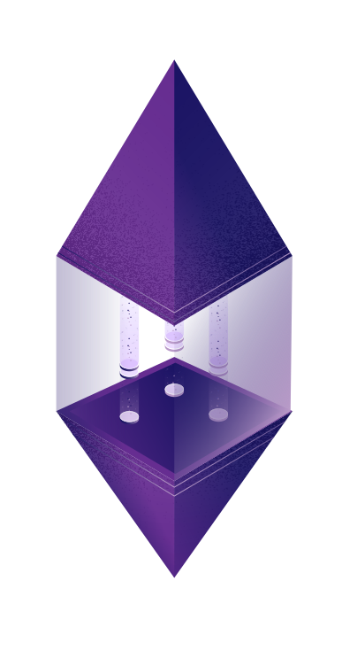
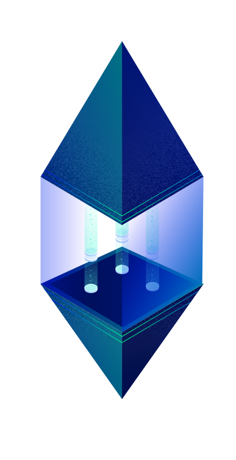

democracy
=========

Minimalist tools for coordinating decentralized and private computation, currently on Ethereum.

Our first major integration is with the AZTEC Protocol, to enable trading of zero-knowledge assets.

[](https://badge.fury.io/js/democracy.js)
[](https://circleci.com/gh/invisible-college/democracy)
[](https://gitter.im/invisible-college/democracy?utm_source=badge&utm_medium=badge&utm_campaign=pr-badge)

[API Documentation](https://invisible-college.github.io/democracy/)

You can include the top-level npm package `democracy.js` or just include the sub-packages you need.


## Install with npm

```
npm i democracy.js
```

Then in your modules

```
const demo = require('democracy.js')
```

## Get the Source Code to Experiment and Run Tests

You can perform all the following commands at a Unix terminal or in a [VS Code]() terminal.

Clone our git repo locally
```
git clone https://github.com:invisible-college/democracy
```

You'll need Node.js v11 or later and the Yarn package manager. Democracy.js is developed with `v11.14.0`.
We recommend using the [Node Version Manager](https://github.com/nvm-sh/nvm#installation), which you can install for any Unix shell (including Mac OSX). `bash` is used in the example below, you can pipe the command and use the shell profile file for your
favorite shell.

```
curl -o- https://raw.githubusercontent.com/nvm-sh/nvm/v0.35.1/install.sh | bash
. ~/.bash_profile
nvm install v11.14.0
curl -o- -L https://yarnpkg.com/install.sh | bash
```

We manage a monorepo of multiple packages with `lerna`.
You can build and test them all at once.
```
cd democracy
lerna bootstrap
lerna run test
```

# Where Are We Going?

Curious about what a future democracy holds? Us too!

Check out our current [RoadMap](./docs/RoadMap.md)

## REPL

To experiment with and administer Ethereum contracts, it's useful to have a central
console able to attach to any JSONRPC endpoint, whether it's on the mainnet or one
of the public testnets (Ropsten, Kovan, Rinkeby).

An example session looks like
```
NODE_ENV=TEST node
> demo = require('demo.js')
> eth = demo.getNetwork()       # you'll hit our public node at http://ganache.arcology.nyc
> eth.accounts().then((val) => accounts = vals)
                                # anything you would normally do (asyncly) with an Eth
```

If you cloned the repo above, you can get started with our test contracts.
As with any JS module, when you import, you are shown a vast menu of delicious options to call.
Unlike with most JS modules, when you call a Democracy function with you arguments,
it tells you what it expects.

The four steps of Ethereum development operate on an automatic contract (sometimes called a `smart contract` by the exuberant)
* compiling (from a high-level language like Solidity to EVM bytecode)
* linking (connecting multiple contracts together, like using a library, and in our case, attaching a deploy account)
* deploy (send a contract to a blockchain, where it will now live and act trustlessly according to its programming)
* operate (send and receive messages from your contract, especially from a web page or app)

The first three tasks we'll show you how to do below by interacting with Democracy in a console.
However, Democracy's real power comes in automating complicated builds and deploys, and then operating on it.

We'll add a blow-by-blow console below when our dust has settled from above.

## Other Links

[Democracy Subpackages](Subpackages.md)

## How to Contribute

Democracy is a framework for learning about distributed systems and community protocols,
as well as a gateway for our upcoming distributed country. Welcome,
especially if you are a beginner to Ethereum or programming.

Here are ways you can participate
* Download the source code, send us suggestions, improvements, tests, documentations, via pull requests
* Use us in your next Ethereum (or eventually, Secure Scuttlebutt) project!
  * The best way to decide what you want in a framework is to try building with it
* If you're in NYC, drop by our [Arcology](http://arcology.nyc) and pair program with us
* Meet and chat with us on our community slack at http://invisible-slack.herokuapp.com
  * (Please read and agree to our community guidelines, which our friendly bot Greedo will give to you upon joining).

While we aim to be stable, featureful, and useful, we are primarily a platform for
cooperation and mob programming.

We are an adventure of the [Invisible College](http://invisible.college).
